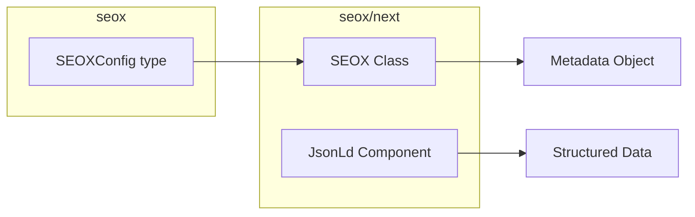

# API Reference

SEOX provides a simple API for managing SEO in your Next.js applications.

## Package Exports



## Main Package (`seox`)

Types and configuration interfaces.

```ts
import type { SEOXConfig } from 'seox';
```

### Exports

| Export | Type | Description |
|--------|------|-------------|
| `SEOXConfig` | Type | Configuration interface |
| `DEFAULT_CONFIG_FILENAME` | Constant | Default config filename |

## Next.js Package (`seox/next`)

React components and utilities for Next.js.

```ts
import { SEOX, JsonLd } from 'seox/next';
```

### Exports

| Export | Type | Description |
|--------|------|-------------|
| [`SEOX`](/docs/api/seox-class) | Class | Metadata generation class |
| [`JsonLd`](/docs/api/json-ld) | Component | Structured data component |

## Quick Reference

### Generate Metadata

```tsx
import { SEOX } from 'seox/next';
import { config } from '@/seox.config';

export async function generateMetadata() {
  return new SEOX(config).metadata({
    title: 'Page Title',
    description: 'Page description',
  });
}
```

### Add Structured Data

```tsx
import { JsonLd } from 'seox/next';

export default function Page() {
  return (
    <>
      <JsonLd
        data={{
          '@context': 'https://schema.org',
          '@type': 'Organization',
          name: 'Acme Inc',
          url: 'https://acme.com',
        }}
      />
      <main>Content</main>
    </>
  );
}
```

## Detailed Documentation

<Cards>
  <Card title="SEOX Class" href="/docs/api/seox-class">
    Metadata generation with type safety
  </Card>
  <Card title="JsonLd Component" href="/docs/api/json-ld">
    Structured data for search engines
  </Card>
</Cards>
