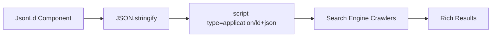

# JsonLd Component

The `JsonLd` component renders JSON-LD structured data in your pages for better search engine understanding.

## Import

```tsx
import { JsonLd } from 'seox/next';
```

## Props

```ts
interface JsonLdProps {
  data: object;
}
```

| Prop | Type | Description |
|------|------|-------------|
| `data` | `object` | The JSON-LD structured data object |

## Basic Usage

```tsx
import { JsonLd } from 'seox/next';

export default function Page() {
  return (
    <>
      <JsonLd
        data={{
          '@context': 'https://schema.org',
          '@type': 'Organization',
          name: 'Acme Inc',
          url: 'https://acme.com',
        }}
      />
      <main>Content</main>
    </>
  );
}
```

## How It Works



The component:
1. Takes your data object
2. Serializes it to JSON
3. Renders it in a `<script type="application/ld+json">` tag
4. Search engines parse this for rich results

## Common Schema Types

### Organization

```tsx
<JsonLd
  data={{
    '@context': 'https://schema.org',
    '@type': 'Organization',
    name: 'Acme Inc',
    url: 'https://acme.com',
    logo: 'https://acme.com/logo.png',
    sameAs: [
      'https://twitter.com/acme',
      'https://linkedin.com/company/acme',
      'https://github.com/acme',
    ],
    contactPoint: {
      '@type': 'ContactPoint',
      telephone: '+1-800-555-1234',
      contactType: 'customer service',
    },
  }}
/>
```

### Article

```tsx
<JsonLd
  data={{
    '@context': 'https://schema.org',
    '@type': 'Article',
    headline: 'Article Title',
    description: 'Article description',
    image: 'https://example.com/article-image.jpg',
    author: {
      '@type': 'Person',
      name: 'John Doe',
      url: 'https://example.com/authors/john',
    },
    publisher: {
      '@type': 'Organization',
      name: 'Acme Inc',
      logo: {
        '@type': 'ImageObject',
        url: 'https://acme.com/logo.png',
      },
    },
    datePublished: '2024-01-15T09:00:00Z',
    dateModified: '2024-01-20T14:30:00Z',
  }}
/>
```

### Product

```tsx
<JsonLd
  data={{
    '@context': 'https://schema.org',
    '@type': 'Product',
    name: 'Premium Widget',
    description: 'The best widget money can buy',
    image: 'https://example.com/widget.jpg',
    brand: {
      '@type': 'Brand',
      name: 'Acme',
    },
    offers: {
      '@type': 'Offer',
      price: '99.99',
      priceCurrency: 'USD',
      availability: 'https://schema.org/InStock',
      seller: {
        '@type': 'Organization',
        name: 'Acme Inc',
      },
    },
    aggregateRating: {
      '@type': 'AggregateRating',
      ratingValue: '4.8',
      reviewCount: '256',
    },
  }}
/>
```

### BreadcrumbList

```tsx
<JsonLd
  data={{
    '@context': 'https://schema.org',
    '@type': 'BreadcrumbList',
    itemListElement: [
      {
        '@type': 'ListItem',
        position: 1,
        name: 'Home',
        item: 'https://example.com',
      },
      {
        '@type': 'ListItem',
        position: 2,
        name: 'Products',
        item: 'https://example.com/products',
      },
      {
        '@type': 'ListItem',
        position: 3,
        name: 'Widgets',
        item: 'https://example.com/products/widgets',
      },
    ],
  }}
/>
```

### FAQ

```tsx
<JsonLd
  data={{
    '@context': 'https://schema.org',
    '@type': 'FAQPage',
    mainEntity: [
      {
        '@type': 'Question',
        name: 'What is SEOX?',
        acceptedAnswer: {
          '@type': 'Answer',
          text: 'SEOX is an SEO library for Next.js applications.',
        },
      },
      {
        '@type': 'Question',
        name: 'How do I install SEOX?',
        acceptedAnswer: {
          '@type': 'Answer',
          text: 'Run bun add seox to install the package.',
        },
      },
    ],
  }}
/>
```

### WebSite with SearchAction

```tsx
<JsonLd
  data={{
    '@context': 'https://schema.org',
    '@type': 'WebSite',
    name: 'Acme Inc',
    url: 'https://acme.com',
    potentialAction: {
      '@type': 'SearchAction',
      target: {
        '@type': 'EntryPoint',
        urlTemplate: 'https://acme.com/search?q={search_term_string}',
      },
      'query-input': 'required name=search_term_string',
    },
  }}
/>
```

## Multiple Schemas

You can include multiple schemas on a single page:

```tsx
export default function ProductPage({ product }) {
  return (
    <>
      {/* Organization schema */}
      <JsonLd
        data={{
          '@context': 'https://schema.org',
          '@type': 'Organization',
          name: 'Acme Inc',
          url: 'https://acme.com',
        }}
      />

      {/* Product schema */}
      <JsonLd
        data={{
          '@context': 'https://schema.org',
          '@type': 'Product',
          name: product.name,
          // ...
        }}
      />

      {/* Breadcrumb schema */}
      <JsonLd
        data={{
          '@context': 'https://schema.org',
          '@type': 'BreadcrumbList',
          // ...
        }}
      />

      <main>{/* Page content */}</main>
    </>
  );
}
```

## Validation

Test your structured data using these tools:

- [Google Rich Results Test](https://search.google.com/test/rich-results)
- [Schema.org Validator](https://validator.schema.org/)

## Best Practices

1. **Place at top of component** - Add `JsonLd` before your main content
2. **Use accurate types** - Match the schema type to your content
3. **Include required properties** - Check schema.org for required fields
4. **Test before deploying** - Use validation tools to catch errors
5. **Keep data fresh** - Update timestamps and dynamic data

## Next Steps

<Cards>
  <Card title="SEOX Class" href="/docs/api/seox-class">
    Generate metadata for your pages
  </Card>
  <Card title="Configuration" href="/docs/configuration">
    Set up your site-wide SEO settings
  </Card>
</Cards>
