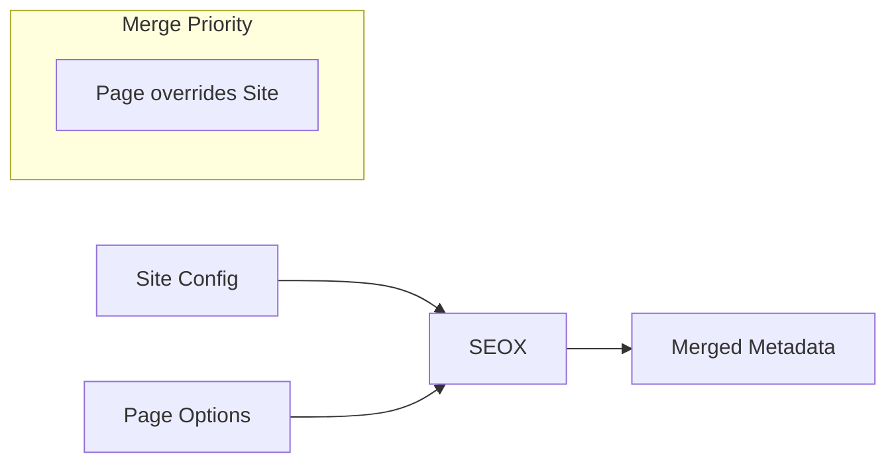

# SEOX Class

The `SEOX` class is the main entry point for generating metadata in your Next.js application.

## Import

```ts
import { SEOX } from 'seox/next';
```

## Constructor

```ts
new SEOX(config: SEOXConfig)
```

### Parameters

| Parameter | Type | Description |
|-----------|------|-------------|
| `config` | `SEOXConfig` | Your site-wide SEO configuration |

### Example

```ts
import { SEOX } from 'seox/next';
import type { SEOXConfig } from 'seox';

const config: SEOXConfig = {
  siteName: 'My Site',
  siteUrl: 'https://example.com',
  defaultTitle: 'My Site',
  titleTemplate: '%s | My Site',
  defaultDescription: 'Welcome to my site',
};

const seo = new SEOX(config);
```

## Methods

### metadata()

Generates a Next.js `Metadata` object for use in `generateMetadata`.

```ts
metadata(options?: MetadataOptions): Metadata
```

#### Parameters

| Option | Type | Description |
|--------|------|-------------|
| `title` | `string` | Page title (uses `defaultTitle` if omitted) |
| `description` | `string` | Page description |
| `keywords` | `string[]` | Page-specific keywords |
| `openGraph` | `object` | Open Graph overrides |
| `twitter` | `object` | Twitter card overrides |

#### Returns

Returns a `Metadata` object compatible with Next.js App Router.

#### Basic Example

```tsx title="app/page.tsx"
import { SEOX } from 'seox/next';
import { config } from '@/seox.config';

export async function generateMetadata() {
  return new SEOX(config).metadata({
    title: 'Home',
    description: 'Welcome to our homepage',
  });
}
```

#### With All Options

```tsx title="app/blog/[slug]/page.tsx"
import { SEOX } from 'seox/next';
import { config } from '@/seox.config';

export async function generateMetadata({ params }) {
  const post = await getPost(params.slug);

  return new SEOX(config).metadata({
    title: post.title,
    description: post.excerpt,
    keywords: post.tags,
    openGraph: {
      type: 'article',
      publishedTime: post.publishedAt,
      authors: [post.author],
      images: [{ url: post.coverImage }],
    },
    twitter: {
      card: 'summary_large_image',
    },
  });
}
```

## Metadata Merging



SEOX merges your site-wide configuration with page-specific options:

| Field | Behavior |
|-------|----------|
| `title` | Uses page title with `titleTemplate` |
| `description` | Page overrides site default |
| `keywords` | Merged arrays |
| `openGraph` | Deep merge, page overrides site |
| `twitter` | Deep merge, page overrides site |

## Type Definitions

```ts
interface MetadataOptions {
  title?: string;
  description?: string;
  keywords?: string[];
  openGraph?: {
    type?: string;
    locale?: string;
    images?: Array<{
      url: string;
      width?: number;
      height?: number;
      alt?: string;
    }>;
    publishedTime?: string;
    authors?: string[];
  };
  twitter?: {
    card?: 'summary' | 'summary_large_image' | 'app' | 'player';
    site?: string;
    creator?: string;
  };
}
```

## Full Page Example

```tsx title="app/products/[id]/page.tsx"
import { SEOX, JsonLd } from 'seox/next';
import { config } from '@/seox.config';

export async function generateMetadata({ params }) {
  const product = await getProduct(params.id);

  return new SEOX(config).metadata({
    title: product.name,
    description: product.description,
    keywords: ['product', ...product.categories],
    openGraph: {
      type: 'product',
      images: [{ url: product.image }],
    },
  });
}

export default async function ProductPage({ params }) {
  const product = await getProduct(params.id);

  return (
    <>
      <JsonLd
        data={{
          '@context': 'https://schema.org',
          '@type': 'Product',
          name: product.name,
          description: product.description,
          image: product.image,
          offers: {
            '@type': 'Offer',
            price: product.price,
            priceCurrency: 'USD',
          },
        }}
      />
      <main>
        <h1>{product.name}</h1>
        {/* Product content */}
      </main>
    </>
  );
}
```

## Next Steps

<Cards>
  <Card title="JsonLd Component" href="/docs/api/json-ld">
    Add structured data to your pages
  </Card>
  <Card title="Configuration" href="/docs/configuration">
    Learn about all configuration options
  </Card>
</Cards>
