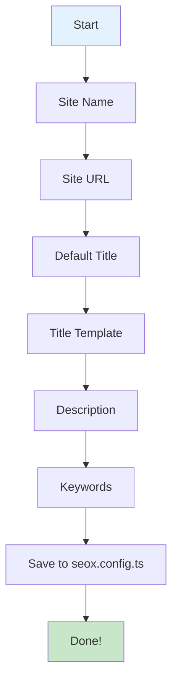

# seox configure

The `configure` command provides an interactive wizard to set up your SEO configuration.

## Usage

```bash
bunx seox configure
```

## Interactive Flow



## Prompts

The wizard guides you through configuring:

| Prompt | Description | Example |
|--------|-------------|---------|
| Site Name | The name of your website | `Acme Inc` |
| Site URL | Your website's canonical URL | `https://acme.com` |
| Default Title | The default page title | `Welcome to Acme` |
| Title Template | Template for page titles | `%s \| Acme Inc` |
| Description | Default meta description | `Innovative solutions...` |
| Keywords | Comma-separated keywords | `acme, technology, innovation` |

## Example Session

```bash
$ bunx seox configure

🔧 SEOX Configuration Wizard

? What is your site name? Acme Inc
? What is your site URL? https://acme.com
? What is your default page title? Welcome to Acme
? What is your title template? %s | Acme Inc
? What is your default description? Innovative solutions for modern businesses
? Enter keywords (comma-separated): acme, technology, innovation

✓ Configuration saved to seox.config.ts

📝 Your configuration has been updated!
   Run 'bunx seox doctor' to verify your setup.
```

## Generated Output

```ts title="seox.config.ts"
import type { SEOXConfig } from 'seox';

export const config: SEOXConfig = {
  siteName: 'Acme Inc',
  siteUrl: 'https://acme.com',
  defaultTitle: 'Welcome to Acme',
  titleTemplate: '%s | Acme Inc',
  defaultDescription: 'Innovative solutions for modern businesses',
  defaultKeywords: ['acme', 'technology', 'innovation'],
};
```

## Options

| Option | Description |
|--------|-------------|
| `--help` | Show help message |

## Next Steps

<Cards>
  <Card title="Verify Setup" href="/docs/cli/doctor">
    Run the doctor command to check your configuration
  </Card>
  <Card title="Advanced Config" href="/docs/configuration">
    Add Open Graph, Twitter cards, and more
  </Card>
</Cards>
