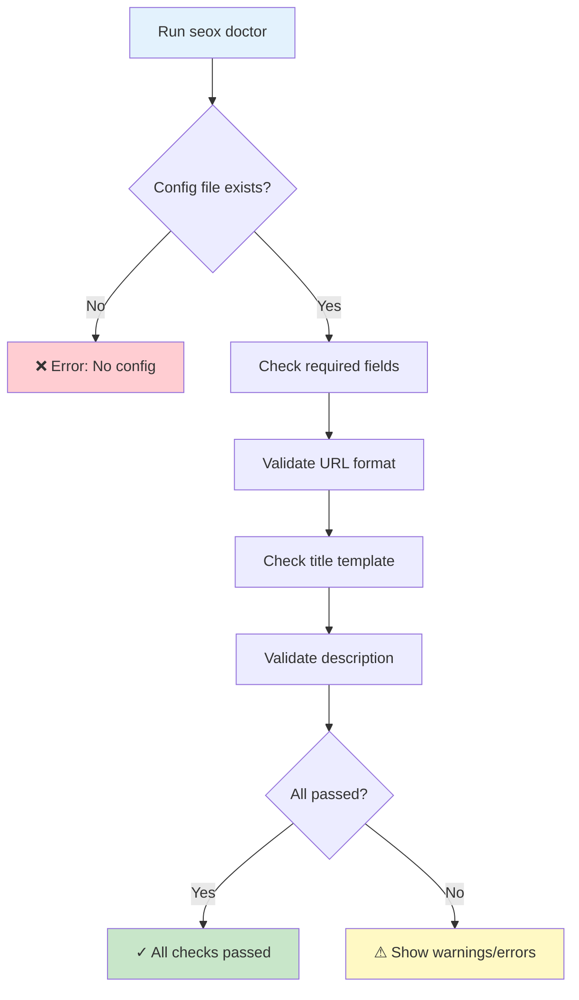

# seox doctor

The `doctor` command analyzes your SEOX configuration and identifies potential issues.

## Usage

```bash
bunx seox doctor
```

## Diagnostic Flow



## What It Checks

| Check | Severity | Description |
|-------|----------|-------------|
| Configuration File | Error | Verifies `seox.config.ts` exists |
| Site Name | Error | Checks if `siteName` is configured |
| Site URL | Error | Validates URL format |
| Title Template | Warning | Verifies `%s` placeholder exists |
| Description Length | Warning | Checks if description is 50-160 characters |
| Keywords | Info | Suggests adding keywords if missing |

## Example Output

### Successful Check

```bash
$ bunx seox doctor

🔍 Running SEOX diagnostics...

✓ Configuration file found
✓ Site name is configured: "Acme Inc"
✓ Site URL is valid: https://acme.com
✓ Title template contains placeholder: "%s | Acme Inc"
✓ Description length is optimal (89 characters)

📊 Summary: 5 passed, 0 warnings, 0 errors
```

### With Issues

```bash
$ bunx seox doctor

🔍 Running SEOX diagnostics...

✓ Configuration file found
✓ Site name is configured: "My Site"
✗ Site URL is invalid: not a valid URL
⚠ Description is too short (45 characters, minimum 50)
⚠ Title template missing %s placeholder

📊 Summary: 2 passed, 2 warnings, 1 error

💡 Suggestions:
   - Fix siteUrl: Use a valid URL like "https://example.com"
   - Add %s to titleTemplate: "%s | My Site"
   - Extend description to at least 50 characters
```

## Exit Codes

| Code | Meaning |
|------|---------|
| `0` | All checks passed |
| `1` | One or more errors found |

## Options

| Option | Description |
|--------|-------------|
| `--verbose` | Show detailed output |
| `--help` | Show help message |

## Fixing Common Issues

### Missing Configuration

```bash
# Create a new configuration file
bunx seox init
```

### Invalid URL

```ts title="seox.config.ts"
// ❌ Invalid
siteUrl: 'example.com',

// ✓ Valid
siteUrl: 'https://example.com',
```

### Missing Title Placeholder

```ts title="seox.config.ts"
// ❌ No placeholder
titleTemplate: 'My Website',

// ✓ With placeholder
titleTemplate: '%s | My Website',
```

### Short Description

```ts title="seox.config.ts"
// ❌ Too short
defaultDescription: 'Welcome!',

// ✓ Optimal length (50-160 chars)
defaultDescription: 'Welcome to Acme Inc. We provide innovative solutions for modern businesses worldwide.',
```

## Next Steps

<Cards>
  <Card title="Configuration Reference" href="/docs/configuration">
    Learn about all available options
  </Card>
  <Card title="Start Using SEOX" href="/docs/api/seox-class">
    Use SEOX in your pages
  </Card>
</Cards>
