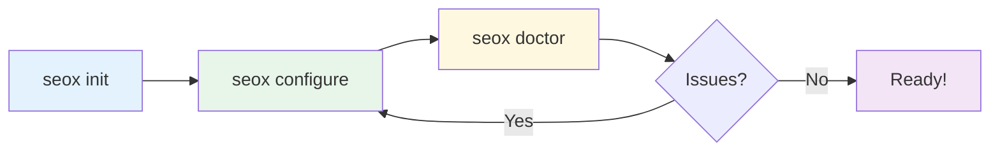

# CLI Commands

SEOX provides a command-line interface to help you set up and manage SEO configuration in your Next.js projects.

## Workflow



## Available Commands

| Command | Description |
|---------|-------------|
| [`seox init`](/docs/cli/init) | Initialize SEOX in your project |
| [`seox configure`](/docs/cli/configure) | Interactive configuration wizard |
| [`seox doctor`](/docs/cli/doctor) | Diagnose configuration issues |

## Usage

Run commands using your package manager:

<Tabs items={['bun', 'npx', 'pnpm']}>
  <Tab value="bun">
    ```bash
    bunx seox <command>
    ```
  </Tab>
  <Tab value="npx">
    ```bash
    npx seox <command>
    ```
  </Tab>
  <Tab value="pnpm">
    ```bash
    pnpm exec seox <command>
    ```
  </Tab>
</Tabs>

## Global Installation

You can also install SEOX globally:

```bash
bun add -g seox

# Then run directly
seox <command>
```

## Getting Help

Use the `--help` flag to see available options:

```bash
bunx seox --help
bunx seox init --help
bunx seox configure --help
bunx seox doctor --help
```

## Command Details

<Cards>
  <Card title="seox init" href="/docs/cli/init">
    Create initial configuration file
  </Card>
  <Card title="seox configure" href="/docs/cli/configure">
    Interactive setup wizard
  </Card>
  <Card title="seox doctor" href="/docs/cli/doctor">
    Diagnose and fix issues
  </Card>
</Cards>
