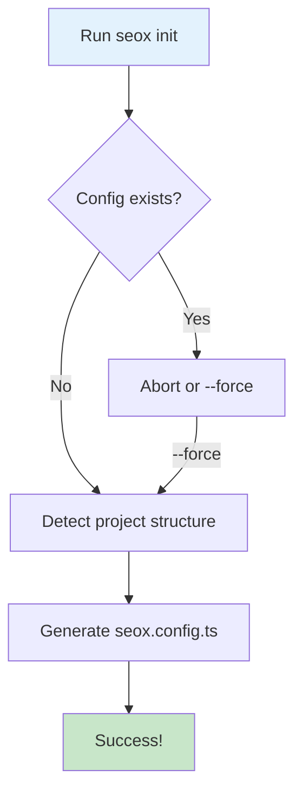

# seox init

The `init` command creates a `seox.config.ts` file in your project with a basic configuration template.

## Usage

```bash
bunx seox init
```

## What It Does



1. Checks if a configuration file already exists
2. Detects your project structure (App Router or Pages Router)
3. Creates a `seox.config.ts` file with sensible defaults

## Generated Configuration

The command generates a configuration file:

```ts title="seox.config.ts"
import type { SEOXConfig } from 'seox';

export const config: SEOXConfig = {
  siteName: 'My Website',
  siteUrl: 'https://example.com',
  defaultTitle: 'My Website',
  titleTemplate: '%s | My Website',
  defaultDescription: 'Welcome to my website',
};
```

## Options

| Option | Description |
|--------|-------------|
| `--force` | Overwrite existing configuration |
| `--help` | Show help message |

## Examples

```bash
# Initialize with default settings
bunx seox init

# Force overwrite existing config
bunx seox init --force
```

## Output Example

```
🚀 Initializing SEOX...

✓ Detected Next.js App Router project
✓ Created seox.config.ts

📝 Next steps:
   1. Edit seox.config.ts with your site details
   2. Run 'bunx seox configure' for interactive setup
   3. Import and use SEOX in your pages
```

## Next Steps

After initialization, you can:

<Cards>
  <Card title="Edit Configuration" href="/docs/configuration">
    Manually edit the configuration file
  </Card>
  <Card title="Run Configure" href="/docs/cli/configure">
    Use the interactive wizard
  </Card>
</Cards>
