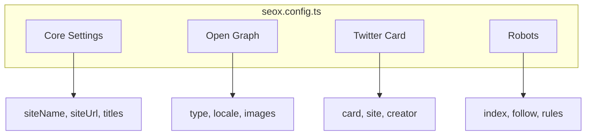

# Configuration

SEOX uses a centralized configuration file to define site-wide SEO settings. This file is typically named `seox.config.ts` and placed at the root of your project.

## Configuration Structure



## Basic Configuration

```ts title="seox.config.ts"
import type { SEOXConfig } from 'seox';

export const config: SEOXConfig = {
  siteName: 'My Website',
  siteUrl: 'https://example.com',
  defaultTitle: 'Welcome to My Website',
  titleTemplate: '%s | My Website',
  defaultDescription: 'A description of my website',
  defaultKeywords: ['keyword1', 'keyword2'],
};
```

## Configuration Options

### Core Options

| Option | Type | Required | Description |
|--------|------|----------|-------------|
| `siteName` | `string` | Yes | The name of your website |
| `siteUrl` | `string` | Yes | The canonical URL of your website |
| `defaultTitle` | `string` | Yes | Default page title |
| `titleTemplate` | `string` | No | Template for page titles (use `%s` as placeholder) |
| `defaultDescription` | `string` | No | Default meta description |
| `defaultKeywords` | `string[]` | No | Default keywords for all pages |

### Open Graph Options

Configure how your pages appear when shared on social media:

```ts title="seox.config.ts"
export const config: SEOXConfig = {
  // ... core options
  openGraph: {
    type: 'website',
    locale: 'en_US',
    siteName: 'My Website',
    images: [
      {
        url: 'https://example.com/og-image.jpg',
        width: 1200,
        height: 630,
        alt: 'My Website',
      },
    ],
  },
};
```

| Option | Type | Description |
|--------|------|-------------|
| `type` | `string` | Content type (`website`, `article`, `product`, etc.) |
| `locale` | `string` | Language/region code |
| `siteName` | `string` | Site name for OG tags |
| `images` | `array` | Array of image objects |

### Twitter Card Options

Configure Twitter/X card appearance:

```ts title="seox.config.ts"
export const config: SEOXConfig = {
  // ... core options
  twitter: {
    card: 'summary_large_image',
    site: '@mywebsite',
    creator: '@author',
  },
};
```

| Option | Type | Description |
|--------|------|-------------|
| `card` | `string` | Card type (`summary`, `summary_large_image`, `app`, `player`) |
| `site` | `string` | Twitter handle of the website |
| `creator` | `string` | Twitter handle of the content creator |

### Robots Configuration

Control search engine indexing:

```ts title="seox.config.ts"
export const config: SEOXConfig = {
  // ... core options
  robots: {
    index: true,
    follow: true,
    googleBot: {
      index: true,
      follow: true,
      'max-image-preview': 'large',
      'max-snippet': -1,
    },
  },
};
```

## Full Example

```ts title="seox.config.ts"
import type { SEOXConfig } from 'seox';

export const config: SEOXConfig = {
  // Core
  siteName: 'Acme Inc',
  siteUrl: 'https://acme.com',
  defaultTitle: 'Acme Inc - Building the Future',
  titleTemplate: '%s | Acme Inc',
  defaultDescription: 'Acme Inc provides innovative solutions for modern businesses.',
  defaultKeywords: ['acme', 'technology', 'innovation'],

  // Open Graph
  openGraph: {
    type: 'website',
    locale: 'en_US',
    siteName: 'Acme Inc',
    images: [
      {
        url: 'https://acme.com/og-image.jpg',
        width: 1200,
        height: 630,
        alt: 'Acme Inc',
      },
    ],
  },

  // Twitter
  twitter: {
    card: 'summary_large_image',
    site: '@acmeinc',
    creator: '@acmeinc',
  },

  // Robots
  robots: {
    index: true,
    follow: true,
  },
};
```

## Using Configuration

Import your configuration and use it with the SEOX class:

```tsx title="app/page.tsx"
import { SEOX } from 'seox/next';
import { config } from '@/seox.config';

export async function generateMetadata() {
  return new SEOX(config).metadata({
    title: 'Home',
    description: 'Welcome to our homepage',
  });
}
```

## Next Steps

<Cards>
  <Card title="SEOX Class API" href="/docs/api/seox-class">
    Learn how to use the SEOX class for metadata generation
  </Card>
  <Card title="CLI Configure" href="/docs/cli/configure">
    Use the interactive CLI to generate configuration
  </Card>
</Cards>
