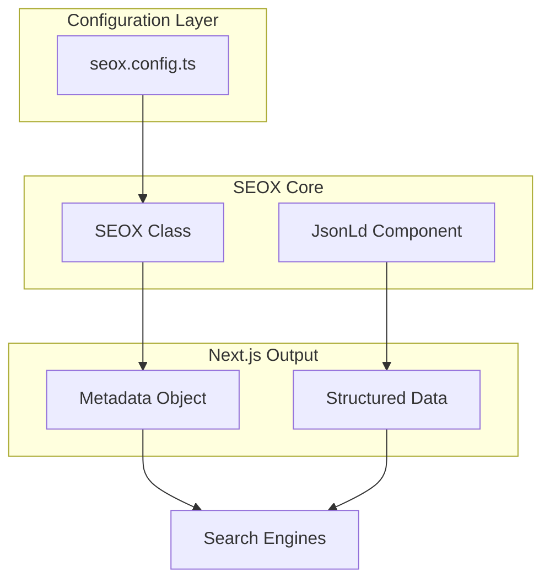
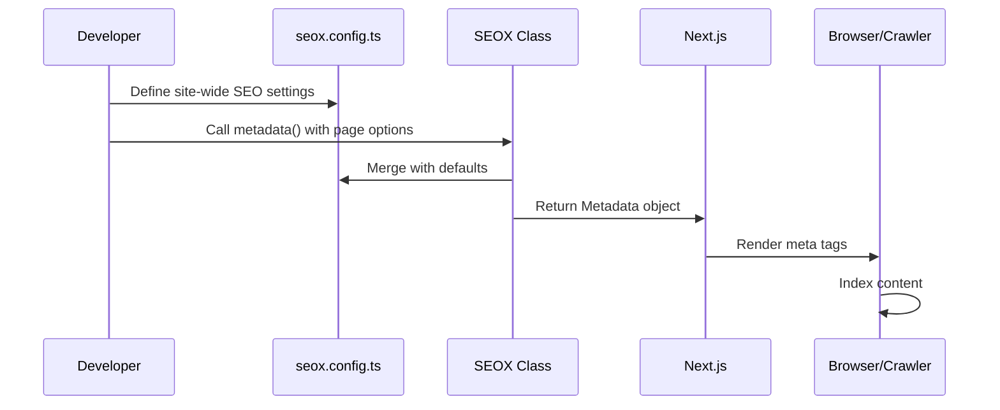

# SEOX

SEOX is a powerful yet simple SEO library for Next.js applications. It provides type-safe metadata management, JSON-LD structured data components, and CLI tools for seamless SEO configuration.

## Architecture Overview



## Features

<Cards>
  <Card title="Type-Safe Metadata" href="/docs/api/seox-class">
    Full TypeScript support with autocomplete for all Next.js metadata fields. Catch errors at build time.
  </Card>
  <Card title="JSON-LD Components" href="/docs/api/json-ld">
    Ready-to-use React components for structured data. Support for Article, Product, Organization, and more.
  </Card>
  <Card title="CLI Tools" href="/docs/cli">
    Initialize projects with `seox init`, configure metadata with `seox configure`, and diagnose issues with `seox doctor`.
  </Card>
</Cards>

## Quick Start

```bash
# Install the package
bun add seox

# Initialize your project
bunx seox init

# Configure your metadata
bunx seox configure
```

## Basic Usage

```tsx title="app/page.tsx"
import { SEOX } from 'seox/next';
import { config } from '@/seox.config';

export async function generateMetadata() {
  return new SEOX(config).metadata({
    title: 'My Page',
    description: 'Page description',
  });
}

export default function Page() {
  return <main>Content</main>;
}
```

## How It Works



## Next Steps

<Cards>
  <Card title="Installation" href="/docs/installation">
    Detailed installation guide and requirements
  </Card>
  <Card title="Configuration" href="/docs/configuration">
    Learn how to configure SEOX for your project
  </Card>
</Cards>
