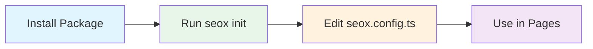

# Installation

## Requirements

| Requirement | Version |
|-------------|---------|
| Node.js | `>=18.0.0` |
| Bun | `>=1.0.0` (recommended) |
| Next.js | `>=14.0.0` |
| React | `>=18.0.0` |
| TypeScript | `>=5.0.0` |

## Package Installation

<Tabs items={['bun', 'npm', 'pnpm', 'yarn']}>
  <Tab value="bun">
    ```bash
    bun add seox
    ```
  </Tab>
  <Tab value="npm">
    ```bash
    npm install seox
    ```
  </Tab>
  <Tab value="pnpm">
    ```bash
    pnpm add seox
    ```
  </Tab>
  <Tab value="yarn">
    ```bash
    yarn add seox
    ```
  </Tab>
</Tabs>

## Project Setup

After installation, initialize your project with the CLI:

```bash
bunx seox init
```

This creates a `seox.config.ts` file in your project root:

```ts title="seox.config.ts"
import type { SEOXConfig } from 'seox';

export const config: SEOXConfig = {
  siteName: 'My Website',
  siteUrl: 'https://example.com',
  defaultTitle: 'My Website',
  titleTemplate: '%s | My Website',
  defaultDescription: 'Welcome to my website',
};
```

## Setup Flow



## TypeScript Configuration

SEOX is written in TypeScript and provides full type support. No additional configuration required.

### Available Imports

```ts
// Types from main package
import type { SEOXConfig } from 'seox';

// Components and classes from Next.js package
import { SEOX, JsonLd } from 'seox/next';
```

## Verify Installation

Run the doctor command to verify your setup:

```bash
bunx seox doctor
```

Expected output:

```
🔍 Running SEOX diagnostics...

✓ Configuration file found
✓ Site name is configured
✓ Site URL is valid
✓ Title template is valid
✓ Description is configured

📊 Summary: 5 passed, 0 warnings, 0 errors
```

## Next Steps

<Cards>
  <Card title="Configuration" href="/docs/configuration">
    Learn about all available configuration options
  </Card>
  <Card title="CLI Commands" href="/docs/cli">
    Explore the CLI tools
  </Card>
</Cards>
